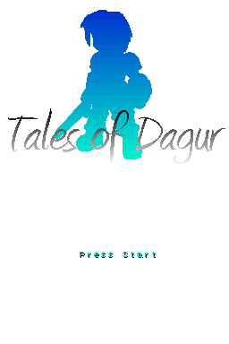
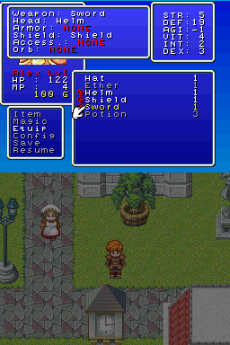
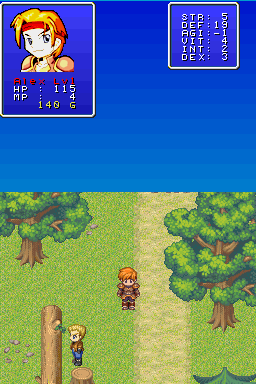
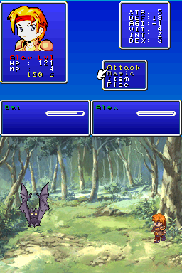
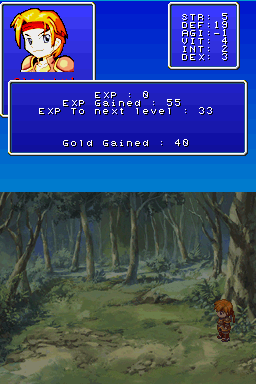

# Tales of Dagur

### Role Playing Game for the Nintendo DS

The kingdom of Dagur is in deep trouble: The holy stone that protects the
kingdom has been stolen. Furthermore, the queen of Dagur has disappeared. A
young lad named Alex is summoned by the king to fix the situation. Help Alex
return the holy stone, find the queen, and by that save the kingdom!

**Don't forget to equip weapons!**

 
 
 

## How to Play

Game:
- D-pad - Movement
- A - Perform Action
- B - Dash
- Start - Ingame menu

Battle:
- D-pad - Navigate in battle menu
- A - Select
- B - Cancel

Shop:
- D-pad - Navigate in shop menu
- A - Select
- B - Cancel

## Missing

- Sound effects
- Magic system

## Comments

The battle system is poorly programmed due to the lack of time. As a result, a
magic system hasn't been implamented yet, but I plan to release it after the
competition.

The game engine is very sleek and smooth, very customable: just change a few
variables, and you are ready to go with your own game.

This game is not a one man's project. Many developers and game artists had given
their hands with this production from the font tileset to the eyecandy graphics.
I thank all the developers and artists who dedicated their time to improve this
game and become what it is today.

You can save the game in emulators and in flashcarts. In flashcarts you will
need to patch the game with DLDI (most loaders do it automatically).

## Build instructions

Install [BlocksDS](https://blocksds.github.io/docs/).

Run the following in the root of this repository:

```bash
bash convert.sh
make
```

## Credits

- Code: LiraNuna
- Moral support and font tileset: Chetic
- Storyboard, Script, & Music collection: RVman
- Graphics: Enterbrain
- Mapping and level design: Nikolas Lahtinen
- Beta-testing: Cameron, Chetic and Nikolas
- Special thanks to Rat for the amazing splash screen!

Greetz fly to: The mellow fellows from #mellowdsdev for the great support (No,
not including you, laZmike), especially: natruim42, dovoto, cReDiAr,
DragonMinded, DarkFader, [DS]LynxW, pepsiman_, joat, dsboi, DynaStab, Furre,
GPF, neimod, Patater, mic And everyone else I have forgotten (No, not you
laZmike!).

Port to BlocksDS by AntonioND.
